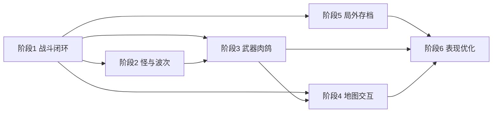

# 敌后幸存者 — 开发计划（分步拆解）

设计原文与数值表见 [敌后幸存者-游戏分步开发设计文档.md](./敌后幸存者-游戏分步开发设计文档.md)。

本文档将六个阶段拆成**可执行子任务**（勾选框用于跟踪进度），并标注**建议代码落点**（相对当前仓库 `src/`，随重构可调整）。

---

## 进度快照（与仓库同步）

| 阶段 | 状态 | 实际落点（主要） |
|------|------|------------------|
| 1 核心闭环 | **已完成** | `src/game/survivor/SurvivorGameModel.ts`、`constants.ts`、`types.ts`；`src/screens/GameScreen.ts`；`src/ui/VirtualJoystick.ts`（浮动摇杆 + 全屏相机） |
| 2 怪与波次 | **基本完成** | `src/game/survivor/enemyDefs.ts`（兵种表、`getSpawnWeights`、`pickSpawnKind`、`difficultyMultiplier`、`spawnIntervalForTime`）；敌弹在 `SurvivorGameModel` |
| 3–6 | 未开始 | — |

**阶段 2 未纳入本快照项**：九四式坦克 BOSS；炮弹预警圈；宝石合并/数量上限清理。

---

## 建议目录演进（模块化）

| 领域 | 建议路径 | 说明 |
|------|----------|------|
| 全局数值 / 表数据 | `src/game/designConfig.ts`、`src/game/survivor/constants.ts`、`enemyDefs.ts` | 设计分辨率；局内常量；**已实现**兵种与波次表 |
| 运行时核心 | `src/game/core/` | 世界状态、时间缩放、事件总线 |
| 实体 | `src/game/entities/` | 玩家、敌人、子弹、拾取物 |
| 系统 | `src/game/systems/` | 移动、碰撞、武器、刷怪、升级 |
| 关卡 / 地图 | `src/game/world/` | 800×800、障碍、迷雾、交互点 |
| UI | `src/screens/HomeScreen.ts`、`GameScreen.ts`、`src/ui/VirtualJoystick.ts` | **已实现**首页、玩法 HUD、升级三选一、阵亡返回、浮动摇杆 |
| 存档 | `src/game/meta/` 或 `src/save/` | 军功、解锁、天赋、序列化 |
| 资源 | `public/` | 图、音频、字体 |

---

## 依赖关系（简图）

---

## 阶段 1：核心战斗闭环

**里程碑**：单怪种、单武器、可升级、HUD 完整，可玩一局。

### 1.1 玩家与地图边界

- [x] 输入：WASD + 方向键统一为移动向量（对角线归一化）；另含触屏浮动摇杆模拟量优先
- [x] 玩家状态：位置、移速倍率；基础移速在 `constants.ts`（`PLAYER_BASE_SPEED` × `PLAYER_MOVE_SCALE`）
- [x] 地图 800×800 逻辑边界夹紧
- [ ] 障碍碰撞（阶段 1 可用「全空地图」或单一矩形障碍占位）— **未做**，平面空地图

**建议**：`src/game/entities/player.ts`、`src/game/systems/movement.ts`、`src/game/world/bounds.ts`  
**当前**：`SurvivorGameModel._playerMove` / `_clampPlayerToMap`

### 1.2 三八式步枪（自动攻击）

- [x] 索敌：最近敌人（距离平方比较）
- [x] 射击 CD、子弹数组 `bullets`
- [x] 子弹与敌人圆形碰撞、伤害应用（阶段 2 起按兵种半径）
- [x] 敌人死亡 → 掉落宝石（内联于 `_onEnemyKilled`，无独立事件总线）

**建议**：`src/game/systems/weaponRifle.ts` 或通用 `weaponBase.ts`  
**当前**：`SurvivorGameModel._rifleTick`、`_integrateBullets`、`_bulletEnemyHits`

### 1.3 普通日军步兵

- [x] 刷怪：地图边缘随机点生成（阶段 2 起按权重随机兵种）
- [x] AI：朝玩家直线移动
- [x] 与玩家接触：伤害间隔 `CONTACT_DAMAGE_INTERVAL`（按兵种 `contactDamage`）
- [x] 死亡：掉落经验宝石 `gems`

**建议**：`src/game/entities/enemy.ts`、`src/game/systems/spawn.ts`  
**当前**：`enemyDefs` + `_spawnEnemyAtEdge`、`SurvivorGameModel._integrateEnemies`、`_enemyPlayerContact`

### 1.4 经验、等级、升级三选一（固定池）

- [x] 拾取范围检测、经验累加
- [x] 等级曲线 `xpToReachNextLevel`（`constants.ts`）
- [x] 满经验 → 暂停 → 三选一 UI（`GameScreen` 遮罩）
- [x] 选项：`+10% 伤害`、`+5% 移速`、`+10 最大生命` → `applyLevelUpChoice`

**建议**：`src/game/systems/progression.ts`、`src/ui/LevelUpModal.tsx`（若用 React 叠 UI）  
**当前**：`SurvivorGameModel` + `GameScreen._levelUpRoot`

### 1.5 基础 HUD

- [x] 血量条、经验条、存活计时、当前等级
- [x] 与模型单向绑定（`update` 内读 `SurvivorGameModel` 绘制）

**建议**：扩展现有 `HomeScreen.ts` 或拆 `src/ui/Hud.ts`  
**当前**：`GameScreen._drawHud`

### 阶段 1 验收

- [x] 可连续游玩；升级可重复触发；阵亡有遮罩并可返回首页（需持续自测回归）

---

## 阶段 2：怪物多样性与波次

**里程碑**：按时间表解锁怪种；远程怪；数值与刷怪率随时间增长。

### 2.1 怪物数据与工厂

- [x] 每种怪：血量、移速、半径、接触伤害、远程参数（`ENEMY_DEFS`）
- [x] 伪军、军犬、骑兵、机枪兵、炮兵、军官 配置入库（+ 步兵）
- [x] 机枪弹：直线、伤害、与玩家圆形碰撞（**未做**略追踪）
- [x] 炮兵：飞向开火时玩家落点、抵近爆炸、范围伤害
- [ ] 炮弹预警圈（可选）— **未做**

**建议**：`src/game/data/enemies.ts`、`src/game/systems/enemyAttack.ts`  
**当前**：`src/game/survivor/enemyDefs.ts`、`SurvivorGameModel._enemyRangedTick`、`_enemyProjectileHits`

### 2.2 波次与时间轴

- [x] 存活时间驱动：`0–3 / 3–5 / 5–7 / 7–8 / 8–10 / 10–15` 分钟解锁（秒阈值：0 / 180 / 300 / 420 / 480 / 600）
- [x] 刷怪权重：`getSpawnWeights` + `pickSpawnKind`
- [x] 每分钟全局：`difficultyMultiplier` → `pow(1.05, floor(gameTime/60))` 作用于生成时生命、接触伤、远程伤
- [x] 刷怪频率：`spawnIntervalForTime`（约 2.15s → 0.22s，按 900s 拉满）

**建议**：`src/game/systems/waveScheduler.ts`  
**当前**：`enemyDefs.ts` 中上述函数；`SurvivorGameModel._spawnTick` 每帧刷新 `spawnInterval`

### 2.3 掉落差异化

- [x] 经验掉落倍率：`gemMultiplier`（军官 ×10 等）→ 生成时写入 `Enemy.gemValue`
- [ ] 死亡位置与拾取物合并规则、场上宝石数量上限 — **未做**

### 2.4 BOSS（九四式坦克）

- [ ] 可与阶段 4 合并打磨；阶段 2 至少预留 `boss` 类型与触发时间（15 分钟）— **未做**

**阶段 2 验收**

- [x] 可通过存活时间验证各时段怪种与远程 / AOE（建议定期自测 + 调参）；后期压力依赖刷怪间隔与难度曲线

---

## 阶段 3：武器与成长系统完善

**里程碑**：全武器 + 全被动 + 8/5 级 + 进化 + 随机三选一池。

### 3.1 武器框架

- [ ] 统一接口：`tick`、等级、伤害/范围/攻速成长曲线
- [ ] 武器：大砍刀、手榴弹、歪把子、地雷、土炮（+ 初始步枪）
- [ ] 同帧多武器互不冲突（执行顺序文档化）

**建议**：`src/game/weapons/*.ts`、`src/game/systems/weaponManager.ts`

### 3.2 被动道具

- [ ] 八种被动效果与叠加规则（同类加法/乘法统一）
- [ ] 被动最高 5 级；升级选项可「+1 级某被动」

**建议**：`src/game/data/passives.ts`、`src/game/systems/stats.ts`（聚合最终属性）

### 3.3 进化

- [ ] 条件判定：指定武器 8 级 + 对应被动满级 → 替换为进化武器
- [ ] UI 提示：进化瞬间反馈（阶段 6 可加强特效）

### 3.4 升级三选一（随机池）

- [ ] 池子：未持有武器、未满被动、通用属性加成
- [ ] 已满级对象不再进入池（或转为金币类替代，若后续有加）
- [ ] 权重可配置（避免永远抽不到新武器）

**阶段 3 验收**

- [ ] 单局可凑出至少两种差异明显的 Build；进化可稳定复现一次

---

## 阶段 4：地图与交互

**里程碑**：村庄视觉 + 碰撞；地道；宝箱；迷雾。

### 4.1 场景与碰撞

- [ ] 瓦片/精灵拼华北村庄；土房阻挡玩家与怪
- [ ] 可行走区域与刷怪点合法化（不在墙内）

**建议**：`src/game/world/map.ts`、`public/map/`

### 4.2 地道

- [ ] 随机刷新入口；进入 → 3s 隐身；怪物清空或冻结对玩家仇恨（按设计二选一，文档推荐「丢失目标」）
- [ ] 结束回到地面、CD 或单次使用（需明文规则）

### 4.3 宝箱

- [ ] 每 5 分钟随机安全点刷新
- [ ] 奖励表：武器等级、被动、一次性属性（接入阶段 3）

### 4.4 地图迷雾

- [ ] 探索纹理或栅格；玩家周围揭开
- [ ] 性能：分块更新 / 降采样

**阶段 4 验收**

- [ ] 障碍与视觉一致；地道与宝箱无软锁；迷雾帧率可接受

---

## 阶段 5：局外成长与存档

**里程碑**：军功、角色、天赋树、本地持久化、启动加载。

### 5.1 结算

- [ ] 统计：存活时间、击杀数（分怪种可选）
- [ ] 军功公式（可配置）：如 `时间×a + 击杀×b`

### 5.2 角色解锁

- [ ] 角色选择界面；默认八路军
- [ ] 民兵 500 / 武工队 1000 / 抗联 1500 军功；效果局内生效

### 5.3 天赋树

- [ ] 节点：全局经验 +5%、初始生命 +10、拾取范围 +10、武器攻速 +5% 等
- [ ] 军功消耗、前置依赖（可选）

### 5.4 存档

- [ ] `localStorage` 或文件（视平台）；含 schema `version` 字段
- [ ] 损坏降级：重置提示 + 备份空档
- [ ] 新开局应用天赋与选中角色

**阶段 5 验收**

- [ ] 刷新页面后进度保留；解锁项在下一局正确应用

---

## 阶段 6：UI、音效与最终优化

**里程碑**：风格统一、听感完整、特效与结算、性能与难度调参。

### 6.1 UI

- [ ] 旧纸张风：色板、边框、按钮、面板
- [ ] 字体：宋体类 Web 字体（注意授权与体积）

### 6.2 音频

- [ ] 武器 SFX、受击、环境；犬吠、人声需谨慎音量与重复
- [ ] BGM 循环与静音设置

### 6.3 特效

- [ ] 弹道、爆炸、命中、升级/进化条

### 6.4 结算界面

- [ ] 击杀、时间、军功；胜利 / 失败文案（与设计文档一致）

### 6.5 优化

- [ ] 大量实体：对象池、批渲染、减少 GC
- [ ] 难度曲线：记录 5/10/15 分钟存活样本调参

**阶段 6 验收**

- [ ] 从主菜单到完整一局 + 结算无阻塞；题材表述严肃

---

## 与「开发注意事项」对齐的检查清单

- [ ] 每阶段结束：自测通过再进入下一阶段（需执行人勾选）
- [x] 数值外置：局内主路径 `survivor/constants.ts` + `enemyDefs.ts`（仍有个别魔法数可继续收拢）
- [ ] 抗日题材：尊重历史、避免恶搞表述与低俗音效（持续校对文案 / 音频）

---

## 文档变更记录

| 日期 | 说明 |
|------|------|
| 2025-03-27 | 初版：从设计文档拆出可勾选子任务与建议目录 |
| 2025-03-27 | 同步进度：阶段 1 完成勾选；阶段 2 基本完成并标注未做项与真实文件路径 |
