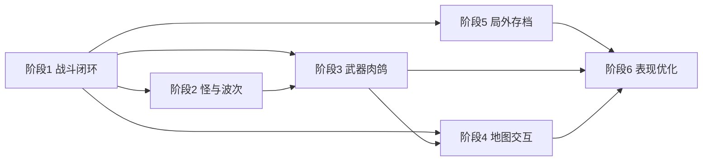

# 敌后幸存者 — 开发计划（分步拆解）

设计原文与数值表见 [敌后幸存者-游戏分步开发设计文档.md](./敌后幸存者-游戏分步开发设计文档.md)。

本文档将六个阶段拆成**可执行子任务**（勾选框用于跟踪进度），并标注**建议代码落点**（相对当前仓库 `src/`，随重构可调整）。

---

## 进度快照（与仓库同步）

| 阶段 | 状态 | 实际落点（主要） |
|------|------|------------------|
| 1 核心闭环 | **已完成** | `SurvivorGameModel.ts`、`constants.ts`、`types.ts`、`obstacleGen.ts`、`collision.ts`、`config/survivorBalance.ts`；`GameScreen.ts`、`VirtualJoystick.ts`；`playerWorldVisual.ts`、`enemyWorldVisual.ts` |
| 2 怪与波次 | **基本完成** | `src/game/survivor/enemyDefs.ts`（兵种表、`getSpawnWeights`、`pickSpawnKind`、`difficultyMultiplier`、`spawnIntervalForTime`）；敌弹在 `SurvivorGameModel` |
| 图鉴（资料 UI） | **已落地一版** | `game/codex/codexData.ts`（四类条目 + 局内数值同源）；**`src/ui/CodexPage.tsx`（React + Tailwind，列表/详情/分档配色）** |
| 局外菜单壳 | **已落地** | **`src/ui/App.tsx`（`HashRouter`）**、`HomePage` / `SettingsPage` / `StatsPage` / `AchievementsPage`；局内仍 **`GameScreen`（Pixi）**；`PixiEmptyScreen.ts` + `shellBridge.ts` 与路由同步 |
| 简易统计 / 成就存档 | **占位已落地** | `achievementStore.ts`（**schema 3** 含 `totalMerit`）、`meritFormula.ts`；React `StatsPage` / `AchievementsPage`；**非**角色解锁 / 天赋树（阶段 5 主体仍缺） |
| 3–6（主里程碑） | 未开始 | 阶段 3 武器框架；阶段 4 **宝箱已接升级卡池**、地道/迷雾仍缺；阶段 5 局外军功与天赋、阶段 6 音效与结算等仍缺 |

**阶段 2 未纳入本快照项**：九四式坦克 BOSS；炮弹预警圈。宝石合并与上限见 `constants.ts` 的 `GEM_MERGE_RADIUS`、`GEM_MAX_ON_FIELD` 与 `SurvivorGameModel._dropXpGem`。

**阶段 6 中已部分落地**（见 §6.1 图鉴、§6.5）：移动端渲染预算、障碍与弹-敌检测、血条环绘制、局内 FPS 显示等；不等同阶段 6 整体验收完成。

---

## 建议目录演进（模块化）

| 领域 | 建议路径 | 说明 |
|------|----------|------|
| 全局数值 / 表数据 | `designConfig.ts`、`survivor/constants.ts`、`enemyDefs.ts`、**`config/survivorBalance.ts`** | 设计分辨率；局内常量；兵种表；**步枪射程与按兵种刷怪批次等可调** |
| 运行时核心 | `src/game/core/` | 世界状态、时间缩放、事件总线 |
| 实体 | `src/game/entities/` | 玩家、敌人、子弹、拾取物 |
| 系统 | `src/game/systems/` | 移动、碰撞、武器、刷怪、升级 |
| 关卡 / 地图 | `src/game/world/` | 设计稿 800 逻辑；**当前** `WORLD_SIZE`（6000）无缝方世界；**已实现**随机矩形障碍（`survivor/obstacleGen.ts` 等）；瓦片村庄、迷雾、交互点未做 |
| UI | **`src/ui/`**：`App.tsx`（路由）、`HomePage` / `CodexPage` / `StatsPage` / `SettingsPage` / `AchievementsPage`；局内 **`GameScreen.ts`**、`VirtualJoystick.ts`；**`screens/PixiEmptyScreen.ts`**（菜单时 Pixi 主层占位）；`playerWorldVisual.ts`、`enemyWorldVisual.ts` | **已实现**主菜单（React）与局内（Pixi）；图鉴见 §6.1；导航淡入淡出仍可用于未来 Pixi 屏（`utils/screenFx.ts`） |
| 存档 | `src/game/meta/` 或 `src/save/` | 军功、解锁、天赋、序列化 |
| 资源 | `public/` | 图、音频、字体 |

---

## 依赖关系（简图）

---

## 阶段 1：核心战斗闭环

**里程碑**：单怪种、单武器、可升级、HUD 完整，可玩一局。

### 1.1 玩家与地图边界

- [x] 输入：WASD + 方向键统一为移动向量（对角线归一化）；另含触屏浮动摇杆模拟量优先
- [x] 玩家状态：位置、移速倍率；基础移速在 `constants.ts`（`PLAYER_BASE_SPEED` × `PLAYER_MOVE_SCALE`）
- [x] 地图方形逻辑边界夹紧（`constants.ts` 的 `WORLD_SIZE`，当前 6000×6000）
- [x] 障碍碰撞：随机轴对齐矩形（`generateObstacles`），玩家 / 敌人圆与 AABB 分离（`resolveCircleWithObstacles`）；玩家普通子弹被挡（`playerBulletBlockedByObstacles`）；`ignoresObstacles` 预留

**建议**：`src/game/entities/player.ts`、`src/game/systems/movement.ts`、`src/game/world/bounds.ts`  
**当前**：`SurvivorGameModel._playerMove`、`_clampPlayerToMap`、`_resolvePlayerVsObstacles`；敌人集成内同套障碍解算；`GameScreen` 背景层绘制 `obstacles`

### 1.2 三八式步枪（自动攻击）

- [x] 索敌：射程内最近敌人（距离平方比较；`survivorBalance.rifle.maxRange`）
- [x] 射击 CD、子弹数组 `bullets`；无射程内目标时不发射且冷却不归负（避免进射程瞬间连发）
- [x] 子弹与敌人圆形碰撞、伤害应用（阶段 2 起按兵种半径）；**多弹道时** 使用 **空间网格**宽相（`SurvivorGameModel._bulletHitGrid*`），缓解 `O(弹×敌)` 帧耗
- [x] 敌人死亡 → 掉落宝石（内联于 `_onEnemyKilled`，无独立事件总线）

**建议**：`src/game/systems/weaponRifle.ts` 或通用 `weaponBase.ts`  
**当前**：`SurvivorGameModel._rifleTick`、`_integrateBullets`、`_bulletEnemyHits`

### 1.3 普通日军步兵

- [x] 刷怪：地图边缘随机点生成（阶段 2 起按权重随机兵种）
- [x] AI：朝玩家直线移动
- [x] 与玩家接触：伤害间隔 `CONTACT_DAMAGE_INTERVAL`（按兵种 `contactDamage`）；**重叠时沿径向推开敌人**（`ENEMY_CONTACT_SEPARATION_PAD` + `resolveCircleWithObstacles`），减轻贴脸叠层连伤
- [x] 死亡：掉落经验宝石 `gems`

**建议**：`src/game/entities/enemy.ts`、`src/game/systems/spawn.ts`  
**当前**：`enemyDefs` + `_spawnEnemyAtEdge`、`getSpawnBatchSize`（`survivorBalance.spawn.batchByKind`）、`_integrateEnemies`、`_enemyPlayerContact`

### 1.4 经验、等级、升级三选一（固定池）

- [x] 拾取范围检测、经验累加
- [x] 等级曲线 `xpToReachNextLevel`（`constants.ts`）
- [x] 满经验 → 暂停 → 三选一 UI（`GameScreen` 遮罩）
- [x] 选项：设计文档基础三项仍支持；**实际**已从 `levelUpCardsConfig` 扩展随机池（攻速、弹道数、暴击、推箱子等），`applyLevelUpChoice` 统一解释

**建议**：`src/game/systems/progression.ts`、升级 UI 可迁 React（当前局内仍为 Pixi）  
**当前**：`SurvivorGameModel` + `GameScreen._levelUpRoot` + `levelUpCardsConfig.ts`

### 1.5 基础 HUD

- [x] 血量条、经验条、存活计时、当前等级
- [x] 与模型单向绑定（`update` 内读 `SurvivorGameModel` 绘制）

**建议**：扩展现有菜单或拆 `src/ui/Hud.ts`  
**当前**：`GameScreen._drawHud`（含右上角 **FPS** 平滑显示，便于移动端自测）

### 1.6 局内单位表现（矢量动画占位）

- [x] 主角：`playerWorldVisual.ts`；`_worldRoot` 顺序为地图 → 主角 → **`_enemyLayer`** → `_worldGfx`（子弹/弹体/宝石压在敌我之上）
- [x] 主角模型 `playerFacing*`、`playerMoving`；暂停/阵亡时冻结步态形变
- [x] 敌人：`enemyWorldVisual.ts` 池与 `enemyKindFill` / `enemyKindStroke`；`Enemy` 含 `facingX` / `facingY` / `animPhase`（生成与 `_integrateEnemies` 更新；相位系数 `ENEMY_ANIM_*`）
- [x] 敌人按 `radius` 缩放剪影；犬/机枪/炮兵略差异化体型与枪长；**环形血条**在 `_worldGfx` 由 **`_drawEnemyHpRing` 闭合路径 `fill`** 绘制（避免移动端对开口弧 `stroke` 的伪影）
- [ ] 主/敌替换为序列帧 `AnimatedSprite` + 图集（阶段 6 或美术到位后）

**当前**：`GameScreen._syncEnemyWorldVisuals`、`playerWorldVisual.sync`

### 阶段 1 验收

- [x] 可连续游玩；升级可重复触发；阵亡有遮罩并可返回首页（需持续自测回归）

---

## 阶段 2：怪物多样性与波次

**里程碑**：按时间表解锁怪种；远程怪；数值与刷怪率随时间增长。

### 2.1 怪物数据与工厂

- [x] 每种怪：血量、移速、半径、接触伤害、远程参数（`ENEMY_DEFS`）
- [x] 伪军、军犬、骑兵、机枪兵、炮兵、军官 配置入库（+ 步兵）
- [x] 机枪弹：直线、伤害、与玩家圆形碰撞（**未做**略追踪）
- [x] 炮兵：飞向开火时玩家落点、抵近爆炸、范围伤害
- [x] 炮弹预警圈：`GameScreen._drawWorldEntities` 对飞行中的 `projKind === 'shell'` 在 `targetX/targetY` 以 `blastRadius` 绘制半透明填充 + 描边，相位随 `gameTime` 闪烁

**建议**：`src/game/data/enemies.ts`、`src/game/systems/enemyAttack.ts`  
**当前**：`src/game/survivor/enemyDefs.ts`、`SurvivorGameModel._enemyRangedTick`、`_enemyProjectileHits`

### 2.2 波次与时间轴

- [x] 存活时间驱动：`0–3 / 3–5 / 5–7 / 7–8 / 8–10 / 10–15` 分钟解锁（秒阈值：0 / 180 / 300 / 420 / 480 / 600）
- [x] 刷怪权重：`getSpawnWeights` + `pickSpawnKind`
- [x] 每分钟全局：`difficultyMultiplier` → `pow(1.05, floor(gameTime/60))` 作用于生成时生命、接触伤、远程伤
- [x] 刷怪频率：`spawnIntervalForTime` × **`survivorBalance.spawn.intervalScale`**（`SPAWN_*` 曲线见 `enemyDefs`）
- [x] 按兵种批次：每次时钟触发对 `pickSpawnKind` 结果连刷 `batchByKind[kind]` 只（各只独立随机边位）

**建议**：`src/game/systems/waveScheduler.ts`  
**当前**：`enemyDefs.ts` + `config/survivorBalance.ts`；`SurvivorGameModel._spawnTick`

### 2.3 掉落差异化

- [x] 经验掉落倍率：`gemMultiplier`（军官 ×10 等）→ 生成时写入 `Enemy.gemValue`
- [x] 死亡位置与拾取物合并规则、场上宝石数量上限（近邻合并 + 超上限并入最近堆）

### 2.4 BOSS（九四式坦克）

- [ ] 可与阶段 4 合并打磨；阶段 2 至少预留 `boss` 类型与触发时间（15 分钟）— **未做**

**阶段 2 验收**

- [x] 可通过存活时间验证各时段怪种与远程 / AOE（建议定期自测 + 调参）；后期压力依赖刷怪间隔与难度曲线

---

## 阶段 3：武器与成长系统完善

**里程碑**：全武器 + 全被动 + 8/5 级 + 进化 + 随机三选一池。

### 3.1 武器框架

- [ ] 统一接口：`tick`、等级、伤害/范围/攻速成长曲线
- [ ] 武器：大砍刀、手榴弹、歪把子、地雷、土炮（+ 初始步枪）
- [ ] 同帧多武器互不冲突（执行顺序文档化）

**建议**：`src/game/weapons/*.ts`、`src/game/systems/weaponManager.ts`

### 3.2 被动道具

- [ ] 八种被动效果与叠加规则（同类加法/乘法统一）
- [ ] 被动最高 5 级；升级选项可「+1 级某被动」

**建议**：`src/game/data/passives.ts`、`src/game/systems/stats.ts`（聚合最终属性）

### 3.3 进化

- [ ] 条件判定：指定武器 8 级 + 对应被动满级 → 替换为进化武器
- [ ] UI 提示：进化瞬间反馈（阶段 6 可加强特效）

### 3.4 升级三选一（随机池）

- [ ] 池子：未持有武器、未满被动、通用属性加成（**设计文档全量**）
- [x] **当前仓库**：`levelUpCardPool` + `levelUpPickCount` 从未重复抽卡；多类属性卡与稀有度档位已接 `applyLevelUpChoice`（**仍为单武器步枪局**，非多武器池）
- [ ] 已满级对象不再进入池（或转为金币类替代，若后续有加）
- [ ] 权重可配置（避免永远抽不到新武器）

**阶段 3 验收**

- [ ] 单局可凑出至少两种差异明显的 Build；进化可稳定复现一次

---

## 阶段 4：地图与交互

**里程碑**：村庄视觉 + 碰撞；地道；宝箱；迷雾。

### 4.1 场景与碰撞

- [ ] 瓦片/精灵拼华北村庄（美术关卡；与当前占位色块分离）
- [x] 矩形土房类障碍阻挡玩家、怪、玩家普通子弹（已实现，见阶段 1 障碍项）
- [x] **刷怪点与土房障碍分离**：`_spawnPositionClearOfObstacles`（`resolveCircleWithObstacles` + 向地图中心微移迭代），减少怪出生在墙内
- [ ] 可行走区域与刷怪点合法化（其余：障碍内禁刷、贴边安全区等未做）

**建议**：`src/game/world/map.ts`、`public/map/`

### 4.2 地道

- [ ] 随机刷新入口；进入 → 3s 隐身；怪物清空或冻结对玩家仇恨（按设计二选一，文档推荐「丢失目标」）
- [ ] 结束回到地面、CD 或单次使用（需明文规则）

### 4.3 宝箱

- [x] 每 5 分钟随机安全点刷新：`CHEST_SPAWN_INTERVAL_SEC`、`SurvivorGameModel._chestSpawnTick`；落点经 `_spawnPositionClearOfObstacles`，距玩家与已有箱分离
- [x] 奖励：与升级池同源均匀随机一张并立即 `apply` 等效数值（`levelUpCardPool` + `_applyLevelUpCardEffect`）；完整多武器/被动表待阶段 3

### 4.4 地图迷雾

- [ ] 探索纹理或栅格；玩家周围揭开
- [ ] 性能：分块更新 / 降采样

**阶段 4 验收**

- [ ] 障碍与视觉一致；地道与宝箱无软锁；迷雾帧率可接受

---

## 阶段 5：局外成长与存档

**里程碑**：军功、角色、天赋树、本地持久化、启动加载。

### 5.1 结算

- [x] 统计：阵亡结算页展示本局存活、击破、**本局军功**（`GameScreen`）；累计数据在 **统计 / 成就** 页（`StatsPage`、`AchievementsPage`）
- [ ] 统计：分怪种击杀可选 — **未做**
- [x] 军功公式（占位）：`meta/meritFormula.ts` 的 `computeRunMerit`（`存活秒×0.35 + 击杀×2` 取整）；累计写入 `PlayerProfileSave.totalMerit`（**schema 3**）
- [ ] 军功公式外置到 `survivorBalance` / 可配置表 — **未做**

### 5.2 角色解锁

- [ ] 角色选择界面；默认八路军
- [ ] 民兵 500 / 武工队 1000 / 抗联 1500 军功；效果局内生效

### 5.3 天赋树

- [ ] 节点：全局经验 +5%、初始生命 +10、拾取范围 +10、武器攻速 +5% 等
- [ ] 军功消耗、前置依赖（可选）

### 5.4 存档

- [ ] `localStorage` 或文件（视平台）；含 schema `version` 字段
- [ ] 损坏降级：重置提示 + 备份空档
- [ ] 新开局应用天赋与选中角色

**阶段 5 验收**

- [ ] 刷新页面后进度保留；解锁项在下一局正确应用

---

## 阶段 6：UI、音效与最终优化

**里程碑**：风格统一、听感完整、特效与结算、性能与难度调参。

### 6.1 UI

- [ ] 旧纸张风：色板、边框、按钮、面板
- [ ] 字体：宋体类 Web 字体（注意授权与体积）

#### 图鉴与资料页（Codex）— 当前进度

**里程碑（本版）**：四类 Tab（主角 / 武器 / 怪物 / 强化卡）、条目与局内配置同源、列表可滚动、详情浮层、强化卡按稀有度分档配色。

- [x] 数据层：`src/game/codex/codexData.ts` — `CodexEntry`（`coreStats`、`listSummary`、`detailExtra`、`cardTier` 等）；`getCodexEntries` / `getCodexCategoryCount`；主角/步枪/敌人/升级卡与 `constants`、`survivorBalance`、`enemyConfig`、`levelUpCardsConfig` 对齐
- [x] 界面：**`src/ui/CodexPage.tsx`（React）** — 顶栏与返回、Tab 角标、分区行「主题 \| 共 N 单位」、单条大卡片 / 多条紧凑行、详情弹层与正文滚动；样式 Tailwind；**原 `CodexScreen.ts`（Pixi）已移除**
- [x] 列表交互：原生滚动 + 点击条目开详情；底部「返回首页」固定区（与旧版意图一致）
- [x] 强化卡表现：按 `LevelUpCardTier` 边框/渐变底与 `levelUpCardTierPresentation` 配色对齐（Web 侧简化实现，无 Pixi 斜线材质层）
- [ ] 图鉴解锁度 / 搜索筛选 / 收藏（需求文档中的进阶项，未做）

### 6.2 音频

- [ ] 武器 SFX、受击、环境；犬吠、人声需谨慎音量与重复
- [ ] BGM 循环与静音设置

### 6.3 特效

- [x] 主/敌 walk / idle 基础表现（程序化矢量，见 §1.6；非弹道特效）
- [ ] 弹道、爆炸、命中、升级/进化条（**部分**：炮弹落点预警圈见 §2.1）

### 6.4 结算界面

- [x] 阵亡遮罩：**存活时长**、**击破**、**本局军功** + 提示点击返回；**胜利**独立结算文案 — **未做**（当前仅阵亡结束）

### 6.5 优化

- [x] **渲染与绘制**：`utils/rendererProfile.ts` 限制画布 `resolution`（DPR 上限）；`main.tsx` `antialias: false`；障碍层 **`obstaclesDirty`** 仅在推箱子位移时整层重绘（`SurvivorGameModel` + `GameScreen._drawMapObstacles`）；HUD 中文案类布局节流（时间/等级）
- [x] **碰撞热点**：步枪弹 vs 敌 **均匀网格**（`SurvivorGameModel._bulletHitGrid*`），缓解多弹道帧耗
- [x] **移动端伪影**：敌人血条由开口弧 `stroke` 改为 **闭合环带 `fill`**（`GameScreen._drawEnemyHpRing`）
- [x] **调试**：局内右上角 **FPS** 显示（`Ticker.FPS` 平滑）
- [ ] 大量实体：对象池、批渲染、减少 GC（敌人视觉仍为每帧矢量重绘）
- [ ] 难度曲线：记录 5/10/15 分钟存活样本调参

**阶段 6 验收**

- [ ] 从主菜单到完整一局 + 结算无阻塞；题材表述严肃

---

## 与「开发注意事项」对齐的检查清单

- [ ] 每阶段结束：自测通过再进入下一阶段（需执行人勾选）
- [x] 数值外置：`survivor/constants.ts`、`enemyDefs.ts`、**`config/survivorBalance.ts`**（射程/刷怪批次与间隔倍率）
- [ ] 抗日题材：尊重历史、避免恶搞表述与低俗音效（持续校对文案 / 音频）

---

## 文档变更记录

| 日期 | 说明 |
|------|------|
| 2025-03-27 | 初版：从设计文档拆出可勾选子任务与建议目录 |
| 2025-03-27 | 同步进度：阶段 1 完成勾选；阶段 2 基本完成并标注未做项与真实文件路径 |
| 2026-03-28 | 同步障碍与世界尺寸；阶段 2.3 宝石近邻合并与 `GEM_MAX_ON_FIELD` |
| 2026-03-28 | 局内主角 `PlayerWorldVisual`：模型朝向/移动态 + idle·walk 程序化动画；文档 §1.6 / 6.3 |
| 2026-03-28 | 刷怪加密：`enemyDefs` 的 `SPAWN_*` 与首刷 `spawnTimer`；阶段 2.2 描述同步 |
| 2026-03-28 | 敌人矢量动画：`enemyWorldVisual.ts`、`Enemy` 朝向/相位；文档 §1.6 / 6.3 |
| 2026-03-28 | `survivorBalance.ts`：步枪射程、按兵种 `batchByKind`、`intervalScale`；文档 §1.2 / 2.2 |
| 2026-03-28 | 首页曾为 Pixi 宫格入口 + 设置/图鉴/成就占位屏 + `screenFx.fadeAlpha`；**2026-03-29 起** 主菜单改为 React 纵向列表（`HomePage`），与文档「2×2 宫格」表述不再一致 |
| 2026-03-28 | **图鉴落地**：`game/codex/codexData.ts` 静态条目与数值同源；`CodexScreen` 版式优化、列表滚动修复（passive 行 + 视口拖拽）、强化卡分档渐变/材质、详情浮层；文档 §6.1 子节「图鉴与资料页」与进度表同步 |
| 2026-03-29 | **菜单 React 化**：除局内 `GameScreen` 外主菜单/图鉴/统计/设置/成就为 `src/ui/*.tsx` + `HashRouter`；`PixiEmptyScreen` + `shellBridge` 与 `/game` 路由同步 |
| 2026-03-29 | **性能与手感**：`rendererProfile`、障碍脏标记、弹-敌空间网格、接触径向推开、血条环 `fill` 修手机红线伪影、局内 FPS；文档进度快照、§1.2/1.3/1.4/1.6、§3.4、§6.1/§6.5 同步 |
| 2026-03-29 | **计划推进**：刷怪点避障（§4.1）；军功 `meritFormula` + 存档 `totalMerit`（§5.1）；阵亡结算 UI 摘要（§6.4）；统计/成就页展示累计军功 |
| 2026-03-29 | **阶段 2.1**：炮兵炮弹落点预警圈（闪烁圆，半径同爆炸判定） |
| 2026-03-29 | **阶段 4.3**：地图宝箱定时刷新 + 拾取随机强化（与升级卡池共用效果）；`GameScreen` 绘制与短时 HUD 提示 |
